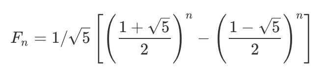

### 题目：

假设你正在爬楼梯。需要 n 阶你才能到达楼顶。

每次你可以爬 1 或 2 个台阶。你有多少种不同的方法可以爬到楼顶呢？

注意：给定 n 是一个正整数。

示例 1：

```
输入： 2
输出： 2
解释： 有两种方法可以爬到楼顶。
1. 1 阶 + 1 阶
2. 2 阶
```

示例 2：

```
输入： 3
输出： 3
解释： 有三种方法可以爬到楼顶。
1. 1 阶 + 1 阶 + 1 阶
2. 1 阶 + 2 阶
3. 2 阶 + 1 阶
```

### 解法一：暴力法

因为每次只能走一步或者两步，也就是当第i个阶梯时，下一个阶梯只能时i+1（i+1<=n）或者i+2（i+2<=n），暴力法就是从第一级阶梯开始，找出所有的可能。

```swift
class Solution {
    func climbStairs(_ n: Int) -> Int {
        return climb_stairs(0, n)
    }

    func climb_stairs(_ i: Int, _ n: Int) -> Int {
        if i > n {
            return 0
        }
        if i == n {
            return 1
        }
        return climb_stairs(i+1, n)+climb_stairs(i+2, n)
    }
}
```

暴力法除了从第一级阶梯开始往上走，还可以从最后一级阶梯往下走。

```swift
class Solution {
    func climbStairs(_ n: Int) -> Int {
        guard n >= 3 else {
            return n
        }
        return climbStairs(n-1)+climbStairs(n-2)
    }
}
```

### 解法二：记忆化递归

因为前面递归的时候，很多值重复计算了，比如：[0, 5] = [1, 5], [2, 5]，[1, 5] = [2, 5],[3, 5] ，[2, 5] = [3, 5],[4, 5]...，这里[2, 5]和[3, 5]都计算了两次，假如将已经算过的[2, 5]和[3, 5]都存下来，则后面就不需要重新计算了。

```swift
class Solution {
    func climbStairs(_ n: Int) -> Int {
        var memo: [Int] = Array.init(repeating: 0, count: n+1)
        return climb_stairs(0, n, &memo)
    }

    func climb_stairs(_ i: Int, _ n: Int, _ memo: inout [Int]) -> Int {
        if i > n {
            return 0
        }
        if i == n {
            return 1
        }
        if memo[i] > 0 {
            return memo[i]
        }
        memo[i] = climb_stairs(i+1, n, &memo)+climb_stairs(i+2, n, &memo)
        return memo[i]
    }
}
```

### 解法三：动态规划

动态规划的解题思路：将当前无法解决的大问题，分解为可以解决或者难度更低一点的子问题，也就是大事化小，小事化了的解决问题思路。

符合动态规划的三大特点：

```
1.最优子结构：当前的问题可以分解为最优的子问题，也就是解决当前的问题，可以分解为解决最优子结构的问题。
2.边界：因为动态规划拥有最优子结构，也就是说，大问题可以不断分解成小问题，那么肯定不能无限分解下去，一定有一个结束的条件，也就是要有边界，换句话说没，就是不用计算就可以得出结果的最优子结构问题。
3.状态转移方程：由最优子结构，边界得出最终解，就是状态转移方程。
```

爬楼梯问题转化成动态规划的问题求解：

```
1.最优子结构：
楼梯级数为1：结果为1
楼梯级数为2：结果为2
楼梯级数为3：结果为3
楼梯级数为4：结果为5
楼梯级数为5：结果为8
...
这里可以看出，F(n)=F(n-1)+F(n-2)，也就是F(n)的最优子结构为F(n-1)和F(n-2)。

2.边界：
F(2)=2
F(1)=1
这可以直接得出结果，也就是边界。
3.状态转移方程：
F(n)={
    1 (n=1)
    2 (n=2)
    F(n-1)+F(n-2) (n>2)
}
```

使用动态规划解决爬楼梯问题：

```swift
class Solution {
    func climbStairs(_ n: Int) -> Int {
        guard n > 1 else {
            return n
        }

        var dp: [Int] = Array.init(repeating: 0, count: n+1)
        dp[1] = 1
        dp[2] = 2
        var i = 3
        while i <= n {
            dp[i] = dp[i-1]+dp[i-2]
            i += 1
        }
        return dp[n]
    }
}
```

### 解法四：斐波那契数列

斐波那契数列：

```
F(n)={
    1 (n=1)
    2 (n=2)
    F(n-1)+F(n-2) (n>2)
}
```

通过前面动态规划的状态转移方程可以直到，其实就是斐波那契数列的方程，所以，可以直接使用：

```swift
class Solution {
    func climbStairs(_ n: Int) -> Int {
        guard n > 3 else {
            return n
        }

        var pre = 2
        var result = 3
        for _ in 4...n {
            let tmp = result
            result += pre
            pre = tmp
        }
        return result
    }
}
```

### 解法五：Binets方法

使用矩阵解题。

```
由斐波那契数列可以得到一个矩阵
Q(n) = ⎡F(n+1)   F(n)⎤  q = ⎡1 1⎤
       ⎣F(n)   F(n-1)⎦      ⎣1 0⎦
那么F(n+1) = Q(n)[0, 0]（表示F(n+1)为Q(n)第0行第0列的数值，也就是F(n+1)）
我们需要得到F(n)和F(n+1)的关系，因为：
Q(n)⎡1 1⎤ = ⎡F(n)   F(n-1)⎤⎡1 1⎤ = ⎡F(n)+F(n-1)     F(n)⎤
    ⎣1 0⎦   ⎣F(n-1) F(n-2)⎦⎣1 0⎦   ⎣F(n-1)+F(n-2) F(n-1)⎦
 =  ⎡F(n+1) F(n)⎤
    ⎣F(n) F(n-1)⎦
也就是F(n+1) = Q(n)⎡1 1⎤[0, 0]
                  ⎣1 0⎦
```

代码实现如下：

```swift
class Solution {
    func climbStairs(_ n: Int) -> Int {
        if n <= 1 {
            return 1
        }
        var q = [[1, 1], [1, 0]]
        var res = [[2, 1], [1, 1]]
        var i = 2
        while i < n {
            res = multiply(res, q)
            i += 1
        }
        return res[0][0]
    }

    func multiply(_ a: [[Int]], _ b: [[Int]]) -> [[Int]] {
        var c: [[Int]] = [[0, 0], [0, 0]]
        for i in 0...1 {
            for j in 0...1 {
                c[i][j] = a[i][0]*b[0][j] + a[i][1]*b[1][j]
            }
        }
        return c
    }
}
```

也是矩阵解法，但是效率更高。其实也是求n个矩阵相乘，只不过并不用乘n次，可以用已经计算的m次矩阵相乘的结果再相乘。假如n个矩阵相乘，可以分解为2个n/2矩阵相乘，然后再分解成4个n/4矩阵相乘。因为有可能不均分，比如7=3+4，那么3可以暂存起来，代码中的ret就是把所有不能均分的结果算出来，最后乘以所有均分的结果就是最终结果。**（最终都是n个矩阵的相乘，只不过通过这种不断二等分的方法，减少矩阵的计算次数。假如还是不理解，建议自己动手计算一下矩阵相乘）**

```swift
class Solution {
    func climbStairs(_ n: Int) -> Int {
        let q = [[1, 1], [1, 0]]
        var res = pow(q, n)
        return res[0][0]
    }

    func pow(_ a: [[Int]], _ n: Int) -> [[Int]] {
        var ret = [[1, 0], [0, 1]]
        var n = n
        var a = a
        while n > 0 {
            if (n&1) == 1 { //是否不能处于2，也就是不能均分需要存一下
                ret = multiply(ret, a)
            }
            n >>= 1  //右移运算符，等同于n/2
            a = multiply(a, a)  //计算均分的结果
        }
        return ret
    }

    func multiply(_ a: [[Int]], _ b: [[Int]]) -> [[Int]] {
        var c: [[Int]] = [[0, 0], [0, 0]]
        for i in 0...1 {
            for j in 0...1 {
                c[i][j] = a[i][0]*b[0][j] + a[i][1]*b[1][j]
            }
        }
        return c
    }
}
```

### 解法六：斐波那契数列公式

斐波那契数列通项公式：



注意：一位5的开方是除不尽的小数，所以会有误差，并且随着计算的数越大，误差越大。

```swift
class Solution {
    func climbStairs(_ n: Int) -> Int {
        let sqrt5 = sqrt(5)
        let fibn = pow((1+sqrt5)/2, Double(n+1)) - pow((1-sqrt5)/2, Double(n+1))
        return Int(fibn/sqrt5)
    }
}
```
