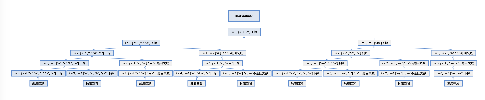

### 题目：

给定一个字符串 s，将 s 分割成一些子串，使每个子串都是回文串。

返回 s 所有可能的分割方案。

```
示例:

输入: "aab"
输出:
[
["aa","b"],
["a","a","b"]
]
```

这道题目我思考🤔了两三天，从刚开始的思路有点乱，因为想到一个字符串里有很多个回文字符串，而且每个回文字符串需要拼接起来正好等于原字符串，这个是问题所在。刚开始，我就考虑到，一下子考虑道结果有点复杂，能不能用动态规划的思想，将大问题分割成小问题，后来发现好像不行，因为"aa"和"aab"好像也什么关系，也有可能自己考虑不到，这条路先放一放。然后，想到能不能先把字符串里所有的回文字符串以及它们在原字符串的位置找出来，然后再组合符合条件的结果。解答从这里开始了。

### 解法一：

先把回文字符串以及它们在原字符串的位置找出来，然后组合符合条件的结果。

```swift
 class Solution {
    func partition(_ s: String) -> [[String]] {
        var res = [[String]]()
        var ch = [String]()
        ch = Array(s.map{String($0)})
        var dic = [String : String]()  //0~1:a 下标~长度:字符串
        var i = 0
        while i < ch.count {
            var j = i
            while j < ch.count {
                var tmp = ""
                for k in i...j {
                    tmp.append(contentsOf: ch[k])
                }
                if isPalindromic(tmp) {
                    dic["\(i)~\(j-i+1)"] = tmp
                }
                j += 1
            }
            i += 1
        }
        let startKeys = Array(dic.keys.filter{$0.hasPrefix("0~")})
        for item in startKeys {

            res.append(contentsOf: compatStr(s.count, [dic[item]!], dic))
        }
        return res
    }

    func isPalindromic(_ str: String) -> Bool {
        if str.isEmpty || str.count == 1 {
            return true
        }

        var i = 0
        var j = str.count-1
        let res = Array(str)
        while i < j {
            if res[i] != res[j] {
                return false
            }
            i += 1
            j -= 1
        }
        return true
    }

    func compatStr(_ length: Int, _ strs: [String], _ dic: [String : String]) -> [[String]] {
        var res = [[String]]()
        let startIndex = strs.reduce(0) { (total, x) -> Int in
            total + x.count
        }
        if startIndex >= length {
            return [strs]
        }
        let startKeys = Array(dic.keys.filter{$0.hasPrefix("\(startIndex)~")})
        if startKeys.count == 0 {
            let strLength = strs.reduce(0) { (total, x) -> Int in
                total + x.count
            }
            if strLength == length {
                return [strs]
            }
            return []
        }
        for item in startKeys {
            var tmp = strs
            tmp.append(dic[item]!)
            res.append(contentsOf: compatStr(length, tmp, dic))
        }
        return res
    }
 }
```

### 解法二：

从解法一的思路，可以整理出来，解其实就是一棵树的结构。

举例：aabaa

```
                    root
                   /  \  \
                  a   aa  aabaa 
                 / \   \
                a  aba  b
               /   /   /  \ 
              b   a   a   aa
             / \      /
            a  aa    a
           /
          a    
结果：
["a", "a", "b", "a", "a"] 
["a", "a", "b", "aa"]
["a", "aba", "a"]
["aa", "b", "a", "a"]
["aa", "b", "aa"]
["aabaa"]
```

使用递归遍历整个树。

```swift
 class Solution {
    func partition(_ s: String) -> [[String]] {
        var res = [[String]]()
        getAllPalindromic(&res, Array(s), [], 0)
        return res
    }

    func isPalindromic(_ str: String) -> Bool {
        if str.isEmpty || str.count == 1 {
            return true
        }

        var i = 0
        var j = str.count-1
        let res = Array(str)
        while i < j {
            if res[i] != res[j] {
                return false
            }
            i += 1
            j -= 1
        }
        return true
    }

    func getAllPalindromic(_ res: inout [[String]], _ strs: [Character], _ candidate: [String], _ i: Int) {
        if i == strs.count {
            let length = candidate.reduce(0) { (total, x) -> Int in
                total + x.count
            }
            if length == strs.count {
                res.append(candidate)
            }
            return
        }
        var j = i
        while j < strs.count {
            let tmp = String(strs[i...j])
            if isPalindromic(tmp) {
                var str = candidate
                str.append(tmp)
                getAllPalindromic(&res, strs, str, j+1)
            }
            j += 1
        }
    }
 }
```

### 解法三：

其实，整理解法二思路的时候，发现，这其实可以用回溯法来解决，如下图：



还是以aabaa为例：

先遍历整个字符串：

["a", "a", "b", "a", "a"]

然后触底回溯，从["a", "a", "b"]的基础上并且"a"已经在前面考虑进去了，所以从"aa"开始判断是否为回文字符串，如果是，则添加进sub数组，然后继续从"aa"下一位开始判断，直到回溯到最前面。

```swift
 class Solution {
    func partition(_ s: String) -> [[String]] {
        if s.isEmpty {
            return []
        }
        if s.count == 1 {
            return [[s]]
        }
        var res = [[String]]()
        var sub = [String]()
        let chars = Array(s)
        backtrace(&res, chars, &sub, 0)
        return res
    }
    
    func backtrace(_ res: inout [[String]], _ chars: [Character], _ sub: inout [String], _ i: Int) {
        if i == chars.count {
            res.append(sub)
            return
        }
        for j in i..<chars.count {
            print("i: \(i) j: \(j)")
            if isPalindromic(chars, start: i, end: j) {
                sub.append(String(chars[i...j]))
                backtrace(&res, chars, &sub, j+1)
                sub.removeLast()
            }
        }
    }
    
    func isPalindromic(_ chars: [Character], start: Int, end: Int) -> Bool {
        var i = start
        var j = end
        while i < j {
            if chars[i] != chars[j] {
                return false
            }
            i += 1
            j -= 1
        }
        return true
    }
 }
```
