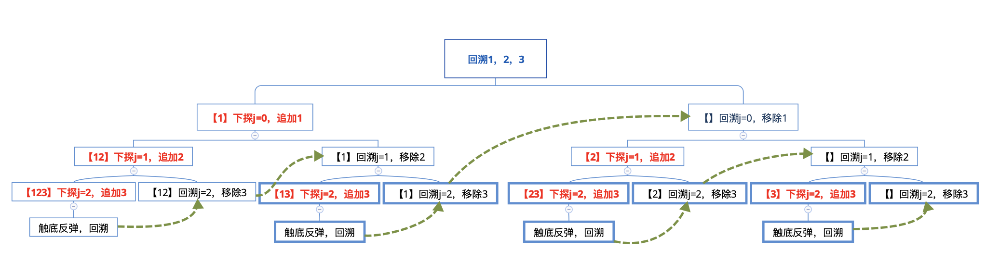

### 题目：

给定一组不含重复元素的整数数组 nums，返回该数组所有可能的子集（幂集）。

说明：解集不能包含重复的子集。

```
示例:

输入: nums = [1,2,3]
输出:
[
  [3],
  [1],
  [2],
  [1,2,3],
  [1,3],
  [2,3],
  [1,2],
  []
]
```

### 解法一：

穷举法，可以将所有可能构造一棵树：

```
          root
        /  \  \
        1   2  3
       / \   \
      2   3   3
     /
    3    
```

然后按层遍历:

```
第0层：[]
第1层：[1], [2], [3]
第2层：[1, 2], [1, 3], [2, 3]
第3层：[1, 2, 3]
```

那么，所有可能的解为：[[], [1], [2], [3], [1, 2], [1, 3], [2, 3], [1, 2, 3]]

```swift
 class Solution {
    class Node {
        var val: Int?
        var next: [Node] = []
        init(_ val: Int?) {
            self.val = val
        }
    }

    func setTree(_ node: inout Node, _ nums: [Int]) {
        var i = 0
        if node.val != nil {
            i = nums.firstIndex(of: node.val!)!+1
        }
        print("i: \(i)")
        while i < nums.count {
            var item = node.next[nums.count-1-i]
            var j = nums.firstIndex(of: item.val!)!+1
            while j < nums.count {
                item.next.append(Node.init(nums[j]))
                j += 1
            }
            setTree(&item, nums)
            i += 1
        }
    }

    func getResult(_ deep: Int, _ root: Node) -> [[Int]] {
        var res: [[Int]] = [[]]
        guard deep > 0 else {
            return res
        }

        for i in 1...deep {
            var tmp = Array<[Node]>()
            for _ in 1...i {
                if tmp.isEmpty {
                    tmp.append(contentsOf: root.next.map{[$0]})
                } else {
                    var tmp2 = Array<[Node]>()
                    for item in tmp {
                        if item.last?.next.count == 0 {
                            continue
                        }
                        for item2 in item.last!.next {
                            var value = item
                            value.append(item2)
                            tmp2.append(value)
                        }
                    }
                    tmp = tmp2
                }
            }
            res.append(contentsOf: tmp.map{$0.map{$0.val!}})
        }

        return res
    }

    func subsets(_ nums: [Int]) -> [[Int]] {
        guard nums.count > 0 else {
            return [[]]
        }

        var root = Node.init(nil)
        root.next.append(contentsOf: nums.map{Node.init($0)})
        setTree(&root, nums)

        return getResult(nums.count, root)
    }
 }
```

### 解法二：

回溯法，使用递归解答，比较难以理解，可以结合下面的图来理解：



回溯123（初始化res = [[]]）：

j = 0，下探，追加1，sub = [1]，res = [[], [1]]

j = 1，下探，追加2，sub = [12]，res = [[], [1], [12]]

j = 2，下探，追加3，sub = [123]，res = [[], [1], [12], [123]]

触底反弹，也就是约束条件j < 3，开始回溯

j = 2，移除最后一个元素（也就是移除以前最后遍历的结点，剪枝），sub = [12]，res = [[], [1], [12], [123]]

触底反弹，也就是约束条件j < 3，继续回溯

j = 1，移除最后一个元素，sub = [1]，res = [[], [1], [12], [123]]

j = 2，下探，追加3，sub = [13]，res = [[], [1], [12], [123], [13]]

触底反弹，也就是约束条件j < 3，继续回溯

j = 2，移除最后一个元素，sub = [1]，res = [[], [1], [12], [123], [13]]

触底反弹，也就是约束条件j < 3，继续回溯

j = 0，移除最后一个元素，sub = []，res = [[], [1], [12], [123], [13]]

j = 1，下探，追加2，sub = [2]，res = [[], [1], [12], [123], [13], [2]]

j = 2，下探，追加3，sub = [23]，res = [[], [1], [12], [123], [13], [2], [23]]

触底反弹，也就是约束条件j < 3，继续回溯

j = 2，移除最后一个元素，sub = [2]，res = [[], [1], [12], [123], [13], [2], [23]]

触底反弹，也就是约束条件j < 3，继续回溯

j = 1，移除最后一个元素，sub = []，res = [[], [1], [12], [123], [13], [2], [23]]

j = 2，下探，追加3，sub = [3]，res = [[], [1], [12], [123], [13], [2], [23], [3]]

触底反弹，也就是约束条件j < 3，继续回溯

j = 2，移除最后一个元素，sub = []，res = [[], [1], [12], [123], [13], [2], [23], [3]]

遍历完成，返回

```swift
//回溯
 class Solution {
    func subsets(_ nums: [Int]) -> [[Int]] {
        /*
         回溯
         集合中每个元素的选和不选，构成了一个满二叉状态树，比如，左子树是不选，右子树是选，从根节点、到叶子节点的所有路径，构成了所有子集。通过回溯，跳过一些节点
         */
        var res : [[Int]] = [[Int]]()
        var sub : [Int] = [Int]()
        backtrace(nums, 0, &sub, &res)
        return res
    }
    private func backtrace(_ nums : [Int], _ i : Int, _ sub : inout [Int], _ res : inout [[Int]]){
        var j = i
        while j < nums.count {
            sub.append(nums[j])
            res.append(sub)
            backtrace(nums, j+1, &sub, &res)
            sub.remove(at: sub.count-1)
            j += 1
        }
    }
 }
```

### 解法三：

和解法二一样的回溯法，但是构造的结果树不一样：

```
       root
     /     \
    0       1
  /  \     /  \
  0   1    0   1 
/  \ / \  / \  / \
0  1 0  1 0  1 0 1
从根结点遍历到叶结点：
[0, 0, 0]
[0, 0, 1]
[0, 1, 0]
[0, 1, 1]
[1, 0, 0]
[1, 0, 1]
[1, 1, 0]
[1, 1, 1]
```

一共三层，每一个结点对应数组里面的一个数，0表示不加入，1表示加入，那么总共有8中可能，分别是：[], [1], [2], [1, 2], [3], [1, 3], [2, 3], [3], [1, 2, 3]

```swift
 //可以看作，当nums为空时，res返回的是什么，然后在这基础之上，逐个添加数据元素
 //空集的幂集只有空集，每增加一个元素，让之前幂集中的每个集合，追加这个元素，就是新增的子集
 //初始化res=[[]]
 //当nums=[1]  => 往前面结果添加1 => [] [1]
 //当nums=[1, 2] => 往前面的结果添加2 => [] [1] [2] [1, 2]
 //当nums=[1, 2, 3] => 往前面的结果添加3 => [] [1] [2] [1, 2] [3] [1, 3] [2, 3] [1, 2, 3]
 //动态规划
 //res = [[]] n = 0
 //res = f(0) + f(0)*nums[n] n n > 0
 class Solution {
    func subsets(_ nums: [Int]) -> [[Int]] {
        guard nums.count > 0 else {
            return [[]]
        }
        var res: [[Int]] = [[]]
        for item in nums {
            let count = res.count
            for i in 0..<count {
                var tmp = res[i]
                tmp.append(item)
                res.append(tmp)
            }
        }
        return res
    }
 }

//递归枚举
 class Solution {
    func subsets(_ nums: [Int]) -> [[Int]] {
        var res: [[Int]] = [[]]
        recurison(nums, 0, &res)
        return res
    }

    func recurison(_ nums: [Int], _ i: Int, _ res: inout [[Int]]) {
        if i >= nums.count {
            return
        }
        let result = res
        for item in result {
            var tmp = item
            tmp.append(nums[i])
            res.append(tmp)
        }
        recurison(nums, i+1, &res)
    }
 }
```

### 解法四：

二进制法，每个数字都只有两种状态，选或者不选，选使用1表示，不选使用0表示，那么输入[1, 2, 3]就有8种可能：

[0, 0, 0] [0, 0, 1] [0, 1, 0] [0, 1, 1] [1, 0, 0] [1, 0, 1] [1, 1, 0] [1, 1, 1]

可以通过二进制移位和1与得出每个选择的数字。

```swift
 class Solution {
    //比如输入: [1, 2, 3]
    //每个数只可能有两种情况：选择 or 不选择
    //则总共有2*2*2=8中情况
    //使用二进制表示：0不选择 1选择
    //[000, 001, 010, 011, 100, 101, 110, 111]
    //总共有三个二进制，通过遍历可以知道相应的数字是否选择或者不选择
    //比如i=3 011 (011>>0)&01=011&01=1 (011>>1)&01=01&01=1 (011>>2)&01=0&01=0
    //可以得出[1, 2]
    func subsets(_ nums: [Int]) -> [[Int]] {
        var res = [[Int]]()
        for i in 0..<nums.count*2 {
            var sub = [Int]()
            for j in 0..<nums.count {
                if ((i >> j) & 1) == 1 {
                    sub.append(nums[j])
                }
            }
            res.append(sub)
        }
        return res
    }
 }
```

### 解法五：

每个元素都由选和不选构成，所有元素的所有可能就构成了一棵满二叉树，从根结点到叶结点的所有路径构成了所有解的集合，通过中序遍历。

```
       root
     /     \
    0       1
   / \     / \
  0   1   0   1
 / \ / \ / \ / \
 0 1 0 1 0 1 0 1
```

```swift
 //需要保证添加进结果数组的操作在添加tmp数组之后
 class Solution {
    func subsets(_ nums: [Int]) -> [[Int]] {
        var res: [[Int]] = [[]]
        inOrder(nums, 0, [], &res)
        return res
    }

    func inOrder(_ nums: [Int], _ i: Int, _ sub: [Int], _ res: inout [[Int]]) {
        if i >= nums.count {
            return
        }

        var tmp = sub
        //左子树，不选
        //不需要加入tmp
        inOrder(nums, i+1, tmp, &res)
        //右子树，选
        //需要加入tmp
        tmp.append(nums[i])
        //因为加入了新的数据，所以需要添加入res
        res.append(tmp)
        inOrder(nums, i+1, tmp, &res)
    }
 }

 //后序
 class Solution {
    func subsets(_ nums: [Int]) -> [[Int]] {
        var res: [[Int]] = [[]]
        postOrder(nums, 0, [], &res)
        return res
    }

    func postOrder(_ nums: [Int], _ i: Int, _ sub: [Int], _ res: inout [[Int]]) {
        if i >= nums.count {
            return
        }

        var tmp = sub
        //左子树，不选
        //不需要加入tmp
        postOrder(nums, i+1, tmp, &res)
        //右子树，选
        //需要加入tmp
        tmp.append(nums[i])
        postOrder(nums, i+1, tmp, &res)
        //因为加入了新的数据，所以需要添加入res
        //后序遍历完再加入res
        res.append(tmp)
    }
 }
```

### 解法六：

思路和解法五一样，只是换成左子树为选，右子树为不选。

```swift
 //需要保证res操作在stack.append之后，在stack.removeLast之前
 class Solution {
    func subsets(_ nums: [Int]) -> [[Int]] {
        var res: [[Int]] = [[]]
        var stack: [Int] = []
        preOrder(nums, 0, &stack, &res)
        return res
    }

    func preOrder(_ nums: [Int], _ i: Int, _ stack: inout [Int], _ res: inout [[Int]]) {
        if i >= nums.count {
            return
        }

        //左子树，选
        stack.append(nums[i])
        res.append(stack)
        preOrder(nums, i+1, &stack, &res)
        //右子树，不选
        stack.removeLast()
        preOrder(nums, i+1, &stack, &res)
    }
 }

 //中序
 class Solution {
    func subsets(_ nums: [Int]) -> [[Int]] {
        var res: [[Int]] = [[]]
        var stack: [Int] = []
        inOrder(nums, 0, &stack, &res)
        return res
    }

    func inOrder(_ nums: [Int], _ i: Int, _ stack: inout [Int], _ res: inout [[Int]]) {
        if i >= nums.count {
            return
        }

        //左子树，选
        stack.append(nums[i])
        inOrder(nums, i+1, &stack, &res)
        res.append(stack)
        //右子树，不选
        stack.removeLast()
        inOrder(nums, i+1, &stack, &res)
    }
 }
```
